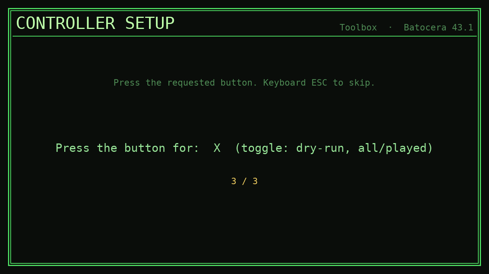

# Batocera Toolbox

A couch-friendly, gamepad-driven utility **Port** for [Batocera](https://batocera.org).
One app, six modules: **Backup**, **Restore**, **ROM Audit**, **BIOS Check**,
**Shaders**, and **Controller setup**. It installs into the PORTS menu and runs
entirely on the machine, so you maintain your cabinet from the couch instead of
SSHing in.

It uses a RetroArch RGUI look (phosphor green on near-black, double-line border,
monospace), so it feels native next to the rest of Batocera.


## Why

Batocera is great, but a few recurring chores still send you to a terminal:
backing up saves before an OS upgrade, figuring out *why* a game won't boot
(usually BIOS), spotting systems with missing scrape data, or applying a CRT
shader to the right systems. The Toolbox puts those on screen, drivable with a
gamepad.

Two design choices keep it trustworthy:

- **Version-aware BIOS checking.** Instead of shipping a hardcoded list of BIOS
  hashes that goes stale on the next Batocera release, the BIOS Check parses
  `batocera-systems` (the tool that ships *with* the OS), so the report always
  reflects whatever version you're actually running.
- **Push-only, dry-run-first backups.** Backup and Restore are plain `rsync`
  over SSH and **never pass `--delete`** — they can only add or update files,
  never remove them. Restore previews (dry-run) by default.

## Screens

| Backup | Restore | ROM Audit |
|---|---|---|
|  |  |  |

| BIOS Check | BIOS detail | Shaders |
|---|---|---|
|  |  |  |

| Controller setup |
|---|
|  |

## Modules

### Backup / Restore
On-demand `rsync` to a server you own, over SSH. **Push-only** (no `--delete`).
Three backup tiers:

| Tier | Contents |
|------|----------|
| Small | `saves` (saves + states) + `system/configs` |
| Medium | Small + `roms` (scraped media excluded to stay lean) |
| Everything | the whole `/userdata` tree + ROMs |

Backups land in `<dest>/userdata/...` and `<dest>/roms/`. **Restore** is the
mirror image: it pulls a category (`saves`, `configs`, `roms`, or the whole
`userdata` tree) back to `/userdata`, lists only the categories that actually
exist on the server, and **defaults to dry-run** so the first action always
previews. See [Configuration](#configuration) to point it at your server.

### ROM Audit
Fast, read-only dashboard. Per system: ROM count, scraped %, missing artwork,
gamelist orphans/duplicates, same-name dup count. Reads the live tree +
`gamelist.xml` only — it does not hash or verify against DATs.

### BIOS Check
Reports which BIOS files are missing/invalid per system, so "why won't this game
boot" is one screen instead of a guess. **Version-aware by construction:** it
parses `batocera-systems`, so the check tracks the installed OS version (no
hardcoded MD5 list to go stale). The installed version is stamped on the report.

The default view shows only the systems you actually play that have a real
problem. `X`/Space toggles to all systems with any problem; Enter drills into a
system to list the exact offending files (`STATUS  md5  path`).

**Core-aware suppression.** `batocera-systems` reports the BIOS need of a
system's *default* core even when you've selected a different core that needs no
BIOS, so a working system can show up red. The checker reads each system's
selected core from `batocera.conf` and, when it matches a known BIOS-free core
(e.g. `colecovision` → `gearcoleco`), drops it from the problem list and marks
it `*` / teal. The header notes how many were hidden this way.

### Shaders
Per-system **renderer-path** picker. Batocera drives shaders through
`<system>-renderer.shader=<path>`, so this manages that key. It enumerates the
shader presets that actually exist under `/usr/share/batocera/shaders` +
`/userdata/shaders`, shows the effective current shader per system, and writes
only a real preset (an invalid value is rejected *before* the file is written).
A timestamped `batocera.conf.bak-toolbox-*` is written before each edit; every
other conf line is preserved.

### Controller setup
Keyboard always works (arrows / WASD, Enter = confirm, Esc = back, Space =
select). For a gamepad, button numbering varies by device, so on first launch
with an unmapped gamepad a short wizard learns your OK, Back, and X buttons
(X = SELECT, used for the in-app toggles). The mapping saves to
`/userdata/saves/ports/toolbox/controls.json`; re-run it any time from the main
menu. Stick directions are read from Batocera's own `es_input.cfg` for the
connected device.

## Install

```bash
# from this directory
./install.sh <your-batocera-ip>        # e.g. ./install.sh 192.168.1.50
```

Or manually over SSH:

```bash
rsync -a --delete --exclude='__pycache__/' -e ssh toolbox/ root@<your-batocera-ip>:/userdata/roms/ports/toolbox/
scp toolbox.sh root@<your-batocera-ip>:/userdata/roms/ports/Toolbox.sh
ssh root@<your-batocera-ip> 'chmod +x /userdata/roms/ports/Toolbox.sh; curl -s http://127.0.0.1:1234/reloadgames'
```

It then appears in the PORTS menu. Batocera ships Python 3, pygame, and rsync,
so there's nothing else to install.

**Bezel note:** Batocera applies a full-screen bezel to ports by default, which
overlays a frame on this app. If you see one, set `ports.bezel=none` in
`batocera.conf` so the Toolbox renders clean.

## Configuration

The Audit, BIOS, Shaders, and Controller modules need no setup. **Backup and
Restore** need a target server, which ships blank so nothing is assumed about
your network. Create
`/userdata/saves/ports/toolbox/settings.json` on the machine:

```json
{
  "backup": {
    "host": "192.168.1.10",
    "port": 22,
    "user": "backup",
    "dest": "/srv/backups/batocera"
  }
}
```

`dest` is the parent directory on the server; backup legs land in
`dest/userdata/...` and `dest/roms/`. Until this is set, Backup/Restore show a
"no backup target configured" message instead of doing anything.

## Architecture

```
toolbox/
  toolbox.sh            ES Ports launcher (installs to /userdata/roms/ports/Toolbox.sh)
  toolbox/              the python package (installs to /userdata/roms/ports/toolbox/)
    __main__.py         `python3 -m toolbox` entry; defers the pygame import
    core/               pure engine, no pygame, unit-tested
      config.py         paths + helpers (all roots env-overridable for tests)
      backup.py         rsync tiers, command building, progress parse, runner
      restore.py        pull a category back (mirror of backup, no --delete)
      audit.py          read-only ROM dashboard
      bios.py           version-aware BIOS check (parses batocera-systems)
      shaders.py        per-system renderer-path picker
    ui/app.py           pygame state-machine UI (menu + all modules)
    ui/controls.py      keyboard + gamepad input, first-run button wizard
    assets/             bundled DejaVuSansMono.ttf
  tests/selftest.py     headless self-test (no pygame, no network)
```

The split is deliberate: every decision (rsync command building, BIOS parsing,
ROM classification) lives in pure `core/` functions that the self-test exercises
without pygame, a network, or a real `/userdata`.

## Test

```bash
python3 tests/selftest.py      # 76 assertions, no pygame/network needed
```

## License

MIT. See [LICENSE](LICENSE).
