# Batocera Toolbox

> **Unofficial.** A community-made add-on, not affiliated with, endorsed by, or
> supported by the [Batocera](https://batocera.org) project or its maintainers.
> It runs *on top of* Batocera; "Batocera" is their project's name. Report
> Toolbox issues here, not to the Batocera team.

A couch-friendly, gamepad-driven utility **Port** for [Batocera](https://batocera.org).
One app, ten modules: **Backup**, **Restore**, **ROM Audit**, **BIOS Check**,
**Shaders**, **Library (1G1R)**, **Performance**, **RetroAchievements**,
**Crash Logs**, and **Controller setup**. It installs into the PORTS menu and runs entirely on the
machine, so you maintain your cabinet from the couch instead of SSHing in.

It uses a RetroArch RGUI look (phosphor green on near-black, double-line border,
monospace), so it feels native next to the rest of Batocera.

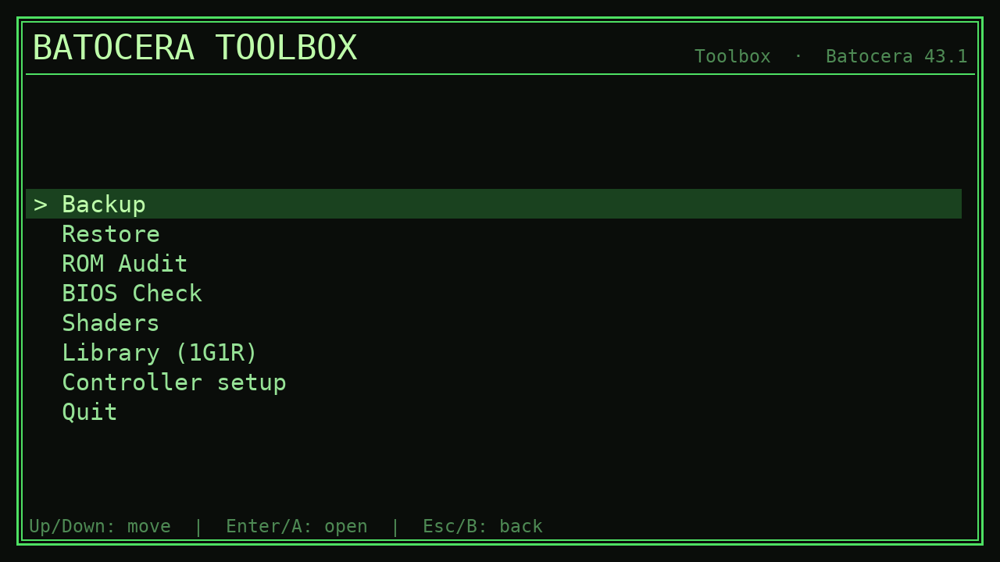

## Why

Batocera is great, but a few recurring chores still send you to a terminal:
backing up saves before an OS upgrade, figuring out *why* a game won't boot
(usually BIOS), spotting systems with missing scrape data, or applying a CRT
shader to the right systems. The Toolbox puts those on screen, drivable with a
gamepad.

Two design choices keep it trustworthy:

- **Version-aware BIOS checking.** Instead of shipping a hardcoded list of BIOS
  hashes that goes stale on the next Batocera release, the BIOS Check parses
  `batocera-systems` (the tool that ships *with* the OS), so the report always
  reflects whatever version you're actually running.
- **Push-only, dry-run-first backups.** Backup and Restore are plain `rsync`
  over SSH and **never pass `--delete`** — they can only add or update files,
  never remove them. Restore previews (dry-run) by default.

## Screens

| Backup | Restore | ROM Audit |
|---|---|---|
| 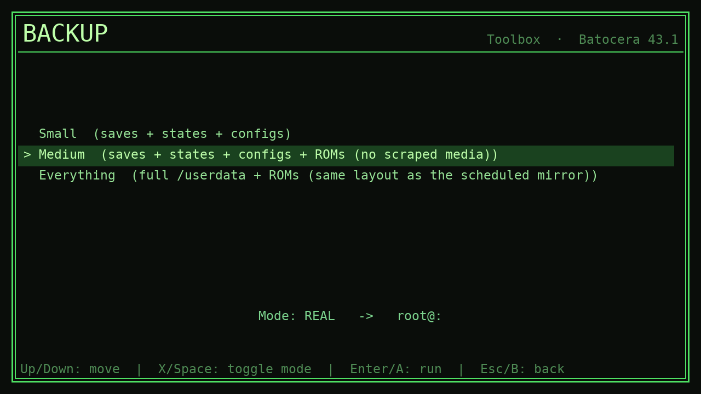 | 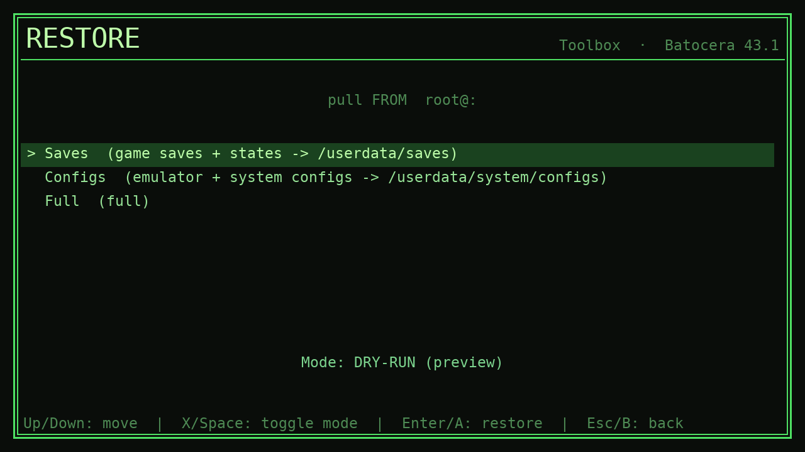 | 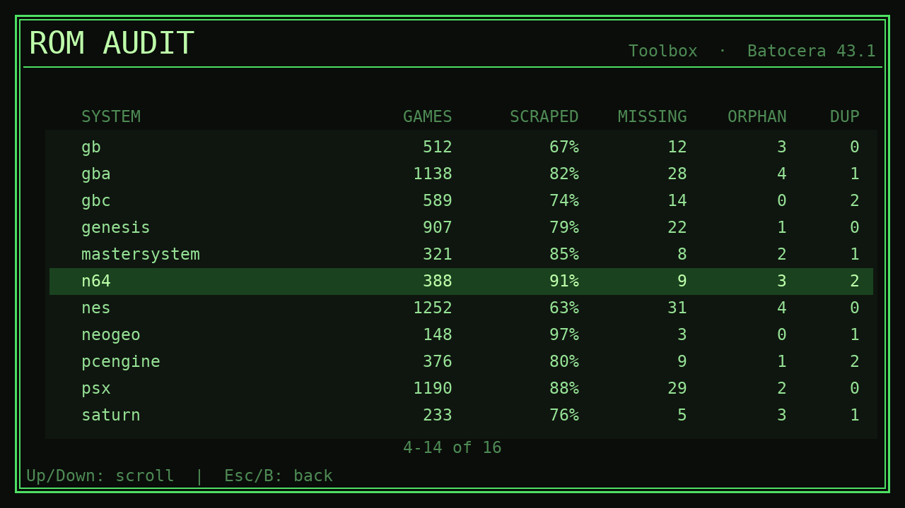 |

| BIOS Check | BIOS detail | Shaders |
|---|---|---|
| 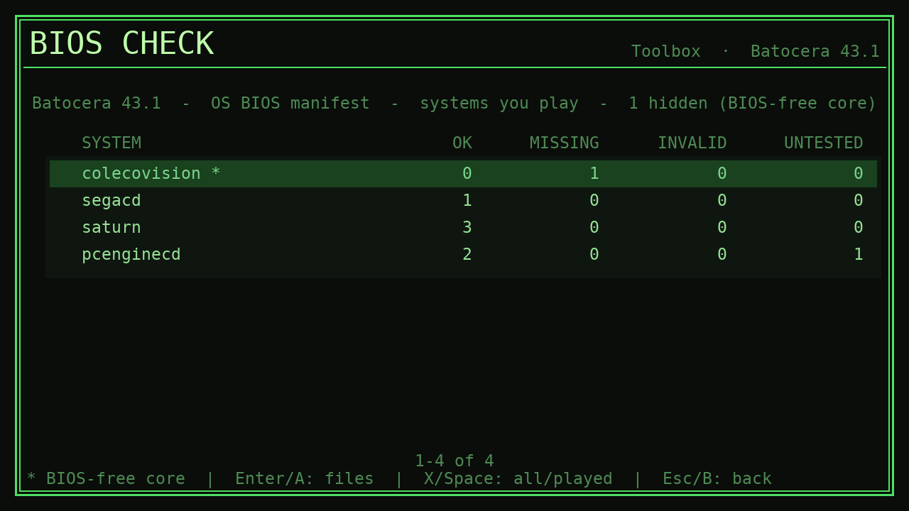 | 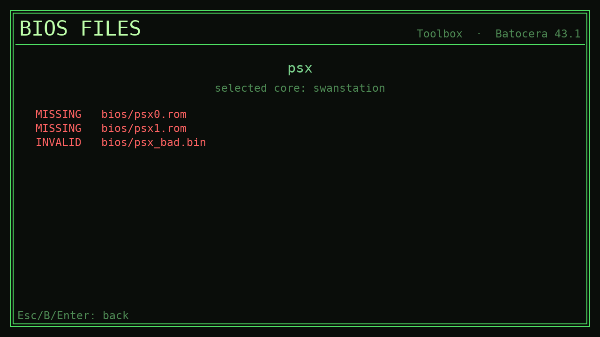 | 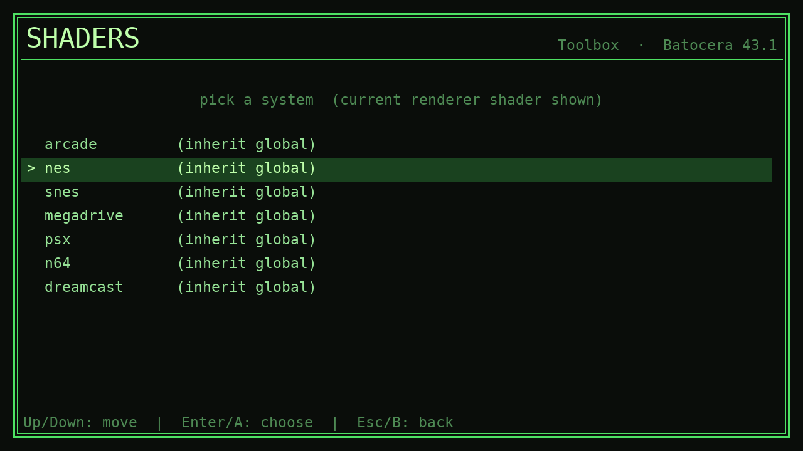 |

| Library (1G1R) | 1G1R preview | Performance |
|---|---|---|
| 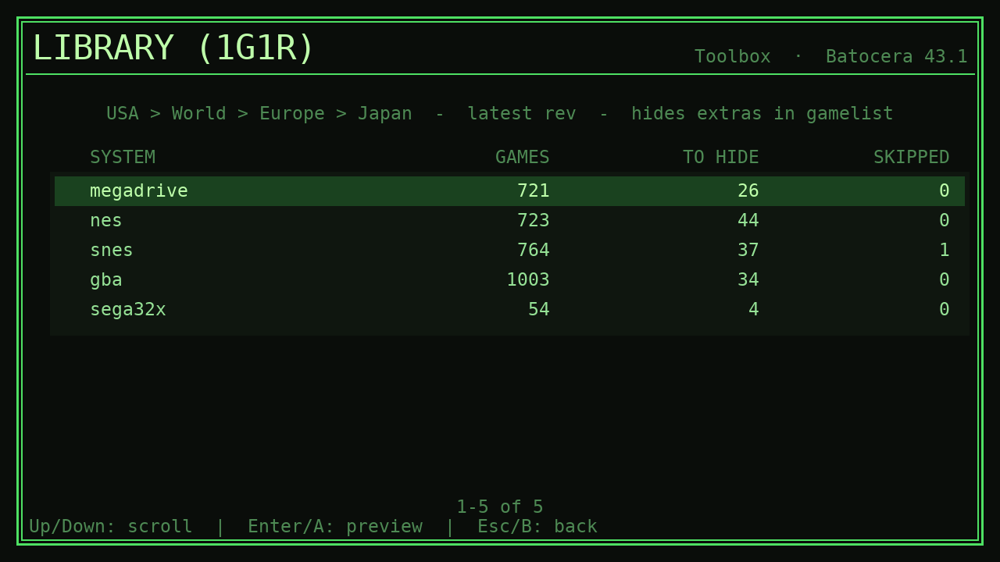 | 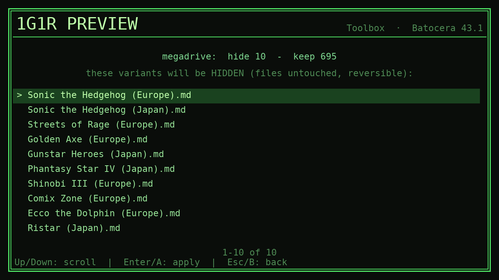 | 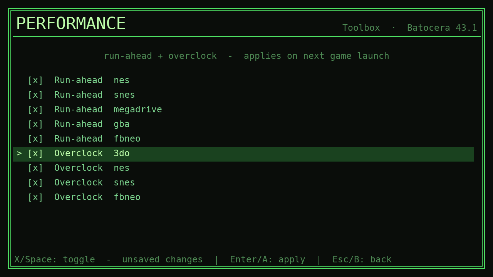 |

| RetroAchievements | 1G1R apply all | Crash Logs |
|---|---|---|
| 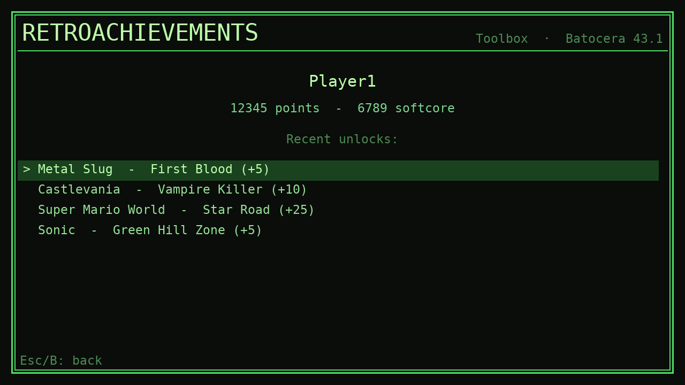 | 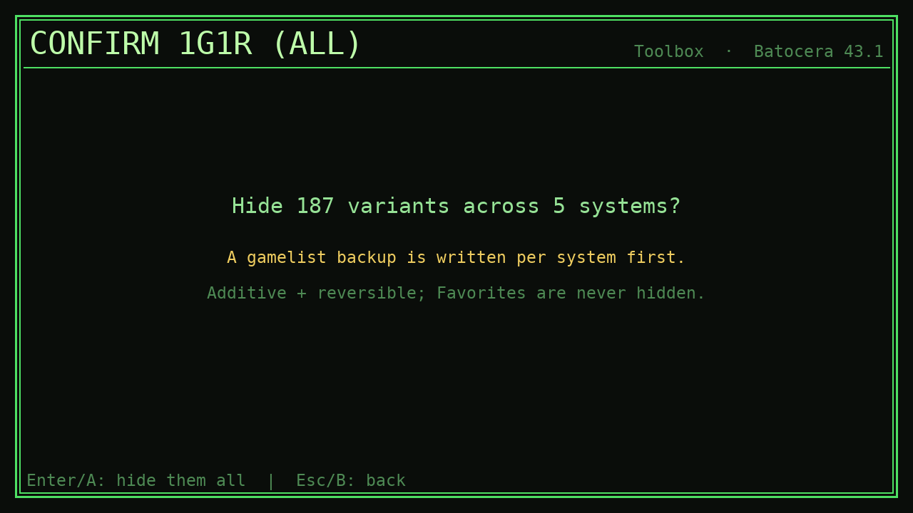 | 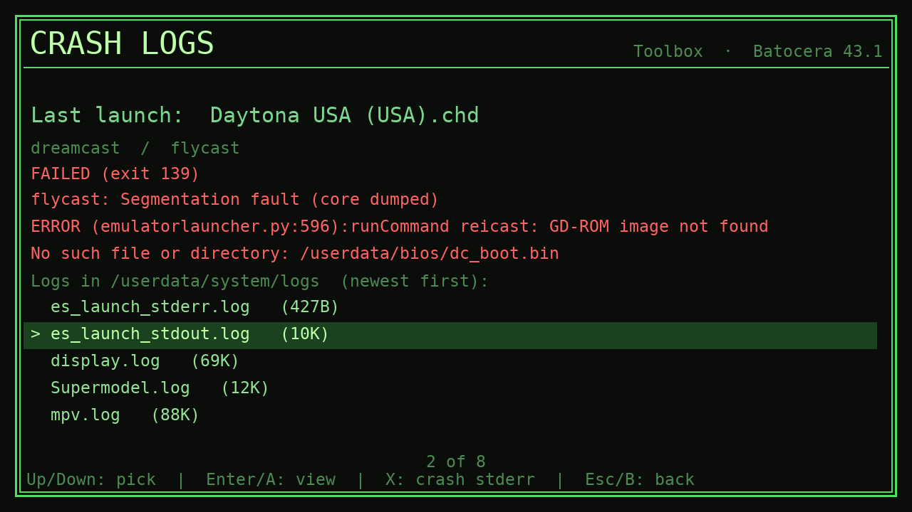 |

## Modules

### Backup / Restore
On-demand `rsync` to a server you own, over SSH. **Push-only** (no `--delete`).
Three backup tiers:

| Tier | Contents |
|------|----------|
| Small | `saves` (saves + states) + `system/configs` |
| Medium | Small + `roms` (scraped media excluded to stay lean) |
| Everything | the whole `/userdata` tree + ROMs |

Backups land in `<dest>/userdata/...` and `<dest>/roms/`. **Restore** is the
mirror image: it pulls a category (`saves`, `configs`, `roms`, or the whole
`userdata` tree) back to `/userdata`, lists only the categories that actually
exist on the server, and **defaults to dry-run** so the first action always
previews. See [Configuration](#configuration) to point it at your server.

### ROM Audit
Fast, read-only dashboard. Per system: ROM count, scraped %, missing artwork,
gamelist orphans/duplicates, same-name dup count. Reads the live tree +
`gamelist.xml` only — it does not hash or verify against DATs. The scan shows a
live `N/total` progress bar and `Esc`/`B` cancels it back to the menu; read-only
scans (audit/BIOS/restore-list/library) all run on a crash-safe worker that
surfaces an error screen instead of hanging if something goes wrong.

### BIOS Check
Reports which BIOS files are missing/invalid per system, so "why won't this game
boot" is one screen instead of a guess. **Version-aware by construction:** it
parses `batocera-systems`, so the check tracks the installed OS version (no
hardcoded MD5 list to go stale). The installed version is stamped on the report.

The default view shows only the systems you actually play that have a real
problem. `X`/Space toggles to all systems with any problem; Enter drills into a
system to list the exact offending files (`STATUS  md5  path`).

**Core-aware suppression.** `batocera-systems` reports the BIOS need of a
system's *default* core even when you've selected a different core that needs no
BIOS, so a working system can show up red. The checker reads each system's
selected core from `batocera.conf` and, when it matches a known BIOS-free core
(e.g. `colecovision` → `gearcoleco`), drops it from the problem list and marks
it `*` / teal. The header notes how many were hidden this way.

### Shaders
Per-system **renderer-path** picker. Batocera drives shaders through
`<system>-renderer.shader=<path>`, so this manages that key. It enumerates the
shader presets that actually exist under `/usr/share/batocera/shaders` +
`/userdata/shaders`, shows the effective current shader per system, and writes
only a real preset (an invalid value is rejected *before* the file is written).
A timestamped `batocera.conf.bak-toolbox-*` is written before each edit; every
other conf line is preserved.

### Library (1G1R)
**1G1R** ("1 Game 1 ROM") collapses a No-Intro/Redump set, which ships many
regional/revision variants of each game, down to one preferred copy per game.
Instead of moving or deleting files, the Toolbox **hides** the non-winners in
`gamelist.xml` (`<hidden>true</hidden>`), which is in-place, reversible, and
respects the hide-based curation Batocera already uses.

Gamelist-first (like Audit): it parses the No-Intro filenames in each `<game>`
entry, groups by base title, and picks a winner per group with the policy
**region `USA > World > Europe > Japan > rest` -> latest revision -> English
tiebreak**, dropping Beta/Proto/Demo/Sample/Program/Pirate/Aftermarket from
winner candidacy (`Unl` is kept: often the only copy). Multi-disc winners keep
**all** discs of the winning release; only other regions' discs hide.

Per-system flow: pick a system (the picker shows eligible systems with a
`GAMES / TO HIDE / SKIPPED` count) -> scroll the exact list of variants that will
be hidden -> confirm. Applying one system **returns to the systems list** (that
system drops off, since it's now deduped) rather than exiting, so you can work
through several in a row. `X` on the systems list is **apply ALL**: one confirm
dedupes every eligible system in a single pass (a per-system gamelist backup is
still written for each). **Guards (always on):** additive only (it only ever *adds*
`hidden`, never un-hides, so manual curation is preserved); never hides a
**Favorite**; **skips** groups with an ambiguous winner (true tie, no tiebreak),
leaving them visible and counted; **arcade families excluded entirely**
(`arcade/mame/fbneo/naomi/...` use short-code names where 1G1R is meaningless). A
`gamelist.xml.bak-toolbox-*` is written before the edit; un-hide in EmulationStation
to revert. Read-only until you confirm; no files are ever moved or deleted.

### Performance
Per-system **run-ahead** and **overclock** toggles, the latency/speed knobs that
otherwise live deep in the RetroArch menus. Run-ahead uses the uniform key pair
(`<system>.runahead` + `.secondinstance`); overclock is offered only for systems
with a verified key map (`3do.cpu_overclock`, `nes.fceumm_overclocking`,
`snes.overclock_superfx`, `fbneo.fbneo-cpu-speed-adjust`) since each emulator
spells it differently. `X` toggles a row in memory; `Enter` applies all staged
changes at once, writing `batocera.conf` with a timestamped backup (same safety
as Shaders). Changes take effect on the next game launch (no ES restart).

### RetroAchievements
Read-only profile view. Reads the username + connect token from `batocera.conf`
and fetches a live summary (points / softcore) from RetroAchievements (a real
`User-Agent` header is sent, or the endpoint returns 403). The richer
recent-unlocks feed needs a separate **web API key** (from retroachievements.org
→ Settings → Keys); drop it in `settings.json` as
`retroachievements.web_api_key` and the view adds the unlock list. Network calls
run on a worker thread with a short timeout; the JSON parsers are unit-tested.
Writes nothing.

### Crash Logs
Read-only crash/log viewer, so "why did that game die" is one screen instead of
an SSH session. It leads with a **last-launch card**: it parses Batocera's
`es_launch_stdout.log` (the `emulatorlauncher.py` launch markers) for the most
recent launch and shows the game, `system / emulator`, and a colored verdict:
green `clean exit (0)`, red `FAILED (exit N)`, or amber `no clean exit recorded
(hang or hard crash?)` when the run never returned. The error lines come from
`es_launch_stderr.log`. Below the card is a newest-first list of every file in
`/userdata/system/logs`; Enter tails one (a bounded read, so a huge `backup.log`
never loads whole), `X` jumps straight to `es_launch_stderr.log`. The
`core/logs.py` parsers are unit-tested; the module writes nothing.

### Controller setup
Keyboard always works (arrows / WASD, Enter = confirm, Esc = back, Space =
select). For a gamepad, button numbering varies by device, so on first launch
with an unmapped gamepad a short wizard learns your OK, Back, and X buttons
(X = SELECT, used for the in-app toggles). The mapping saves to
`/userdata/saves/ports/toolbox/controls.json`; re-run it any time from the main
menu. Stick directions are read from Batocera's own `es_input.cfg` for the
connected device.

## Install

On the Batocera machine (recommended), from an SSH shell:

```bash
curl -fsSL https://raw.githubusercontent.com/t3chnaztea/batocera-toolbox/v0.3.1/install.sh | bash
```

It downloads the Toolbox, installs it into the PORTS menu with its icon and
description, and (in an interactive shell) runs a short onboarding wizard
(optional backup target + the bezel fix below). No `git` needed; Batocera
already ships Python, pygame, rsync, curl, and whiptail.

That one-liner pins to the **`v0.3.1`** release for a reproducible install. For
the rolling latest, swap `v0.3.1` for `main` (or set `TOOLBOX_REF=main`). As
with any `curl | bash` installer, this runs as root and trusts this repo. Read
[`install.sh`](install.sh) first if you'd rather not, or clone and run it
locally.

Lifecycle -- the same one-liner with a flag:

```bash
curl -fsSL https://raw.githubusercontent.com/t3chnaztea/batocera-toolbox/main/install.sh | bash -s -- --update      # re-pull latest (keeps your settings)
curl -fsSL https://raw.githubusercontent.com/t3chnaztea/batocera-toolbox/main/install.sh | bash -s -- --uninstall   # remove it (add --purge to also wipe settings.json)
curl -fsSL https://raw.githubusercontent.com/t3chnaztea/batocera-toolbox/main/install.sh | bash -s -- --config      # re-run the onboarding wizard
```

Or push from a dev machine instead:

```bash
./install.sh <your-batocera-ip>        # e.g. ./install.sh 192.168.1.50
```

**Bezel note:** Batocera applies a full-screen bezel to ports by default, which
overlays a frame on this app. If you see one, set `ports.bezel=none` in
`batocera.conf` so the Toolbox renders clean.

## Configuration

The Audit, BIOS, Shaders, and Controller modules need no setup. **Backup and
Restore** need a target server, which ships blank so nothing is assumed about
your network. Create
`/userdata/saves/ports/toolbox/settings.json` on the machine:

```json
{
  "backup": {
    "host": "192.168.1.10",
    "port": 22,
    "user": "backup",
    "dest": "/srv/backups/batocera"
  }
}
```

`dest` is the parent directory on the server; backup legs land in
`dest/userdata/...` and `dest/roms/`. Until this is set, Backup/Restore show a
"no backup target configured" message instead of doing anything.

## Architecture

```
toolbox/
  toolbox.sh            ES Ports launcher (installs to /userdata/roms/ports/Toolbox.sh)
  toolbox/              the python package (installs to /userdata/roms/ports/toolbox/)
    __main__.py         `python3 -m toolbox` entry; defers the pygame import
    core/               pure engine, no pygame, unit-tested
      config.py         paths + helpers (all roots env-overridable for tests)
      backup.py         rsync tiers, command building, progress parse, runner
      restore.py        pull a category back (mirror of backup, no --delete)
      audit.py          read-only ROM dashboard
      bios.py           version-aware BIOS check (parses batocera-systems)
      shaders.py        per-system renderer-path picker
      library.py        1G1R dedup: hide redundant variants in gamelist.xml
      perf.py           per-system run-ahead + overclock toggles
      cheevos.py        RetroAchievements profile view (read-only)
      logs.py           crash-log viewer: parse last launch + tail logs
    ui/app.py           pygame state-machine UI (menu + all modules)
    ui/controls.py      keyboard + gamepad input, first-run button wizard
    assets/             bundled DejaVuSansMono.ttf
  tests/selftest.py     headless self-test (no pygame, no network)
```

The split is deliberate: every decision (rsync command building, BIOS parsing,
ROM classification) lives in pure `core/` functions that the self-test exercises
without pygame, a network, or a real `/userdata`.

## Test

```bash
python3 tests/selftest.py      # 198 assertions, no pygame/network needed
```

## License

MIT. See [LICENSE](LICENSE).
